# Jarkom-Modul-4-IT17-2023

Laporan resmi dari modul keempat mata kuliah Komunikasi Data dan Jaringan Komputer IT ITS 2023.

## Authors

| NRP        | Nama                       |
| :--------  | :------------------------  |
| 5027211038 | Ahnaf Musyaffa             |
| 5027211056 | Gilbert Immanuel Hasiholan |

## Topologi

## VLSM
### Topologi VLSM
Tentukan subnet dari topologi, dengan metode VLSM.
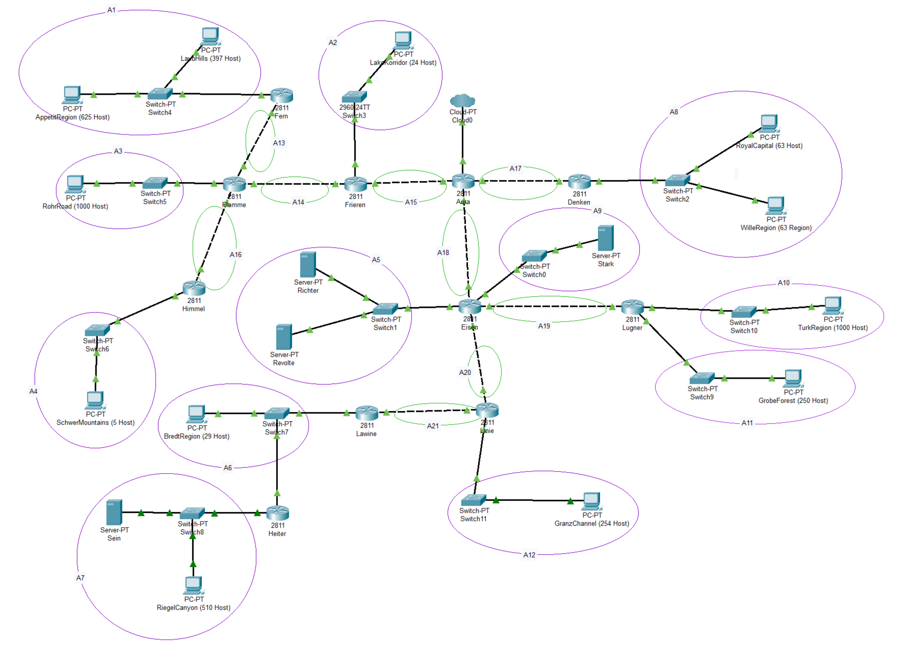

### Rute dan Subnet Mask
Tentukan subnet mask dari masing-masing subnet, dengan jumlah host yang dibutuhkan yang tercamtum di topologi.
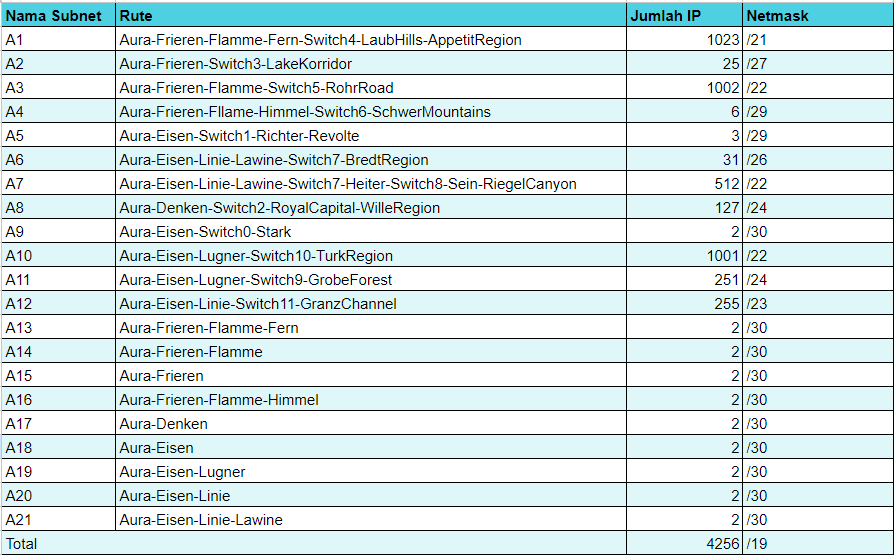

### Konfigurasi IP
Buat perhitungan dari subnet mask dari masing-masing subnet untuk menentukan pembagian konfigurasi IP.
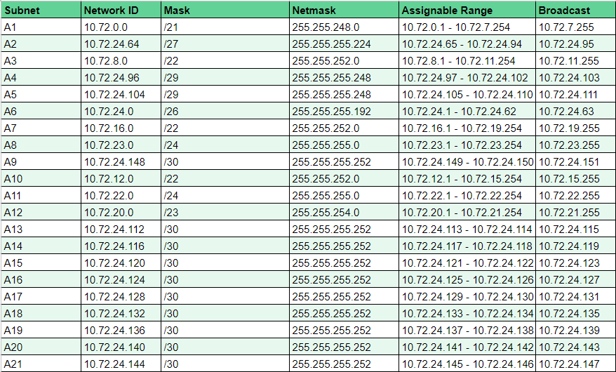

### VLSM Tree
Berdasarkan konfigurasi IP yang sudah didapatkan, gambarkan tree VLSM nya.
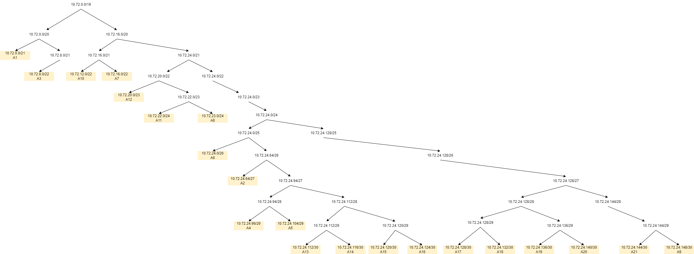

### Konfigurasi di CPT
1) Subnetting\
    Atur IP interface dari router yang mengarah ke client.\
    (Contoh: Subnet A2, Frieren -> Switch3 -> LakeKorridor)\
    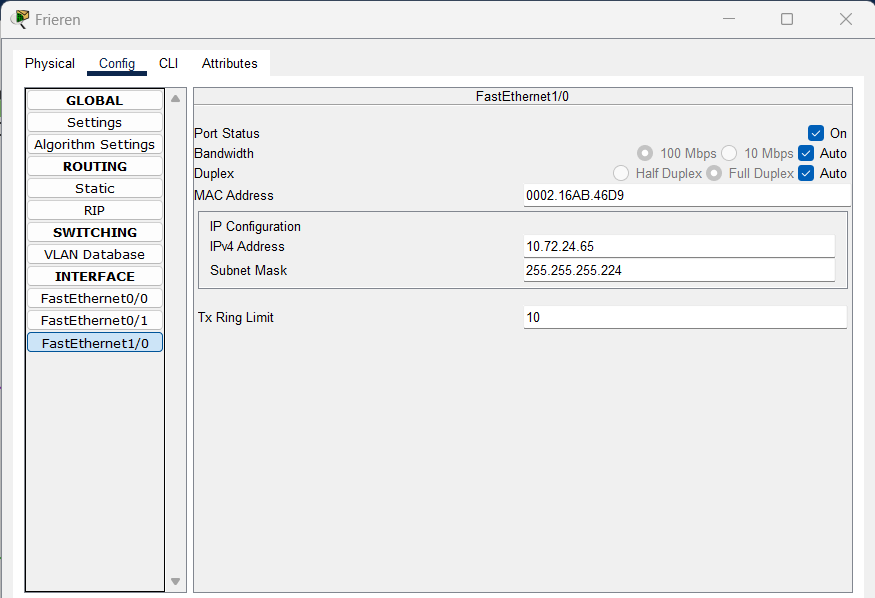

    Atur IP interface dari client yang mengarah ke router.
    (Contoh: Subnet A2, LakeKorridor -> Switch3 -> Frieren)
    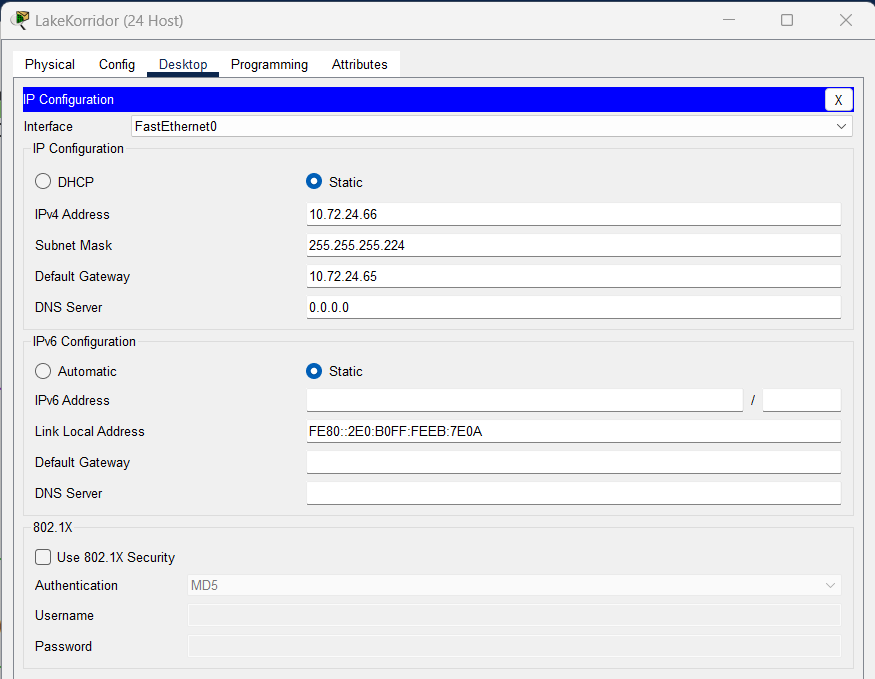

    Atur IP interface dari router utama yang mengarah ke router subnet.
    (Contoh: Subnet A15, Aura -> Frieren)
    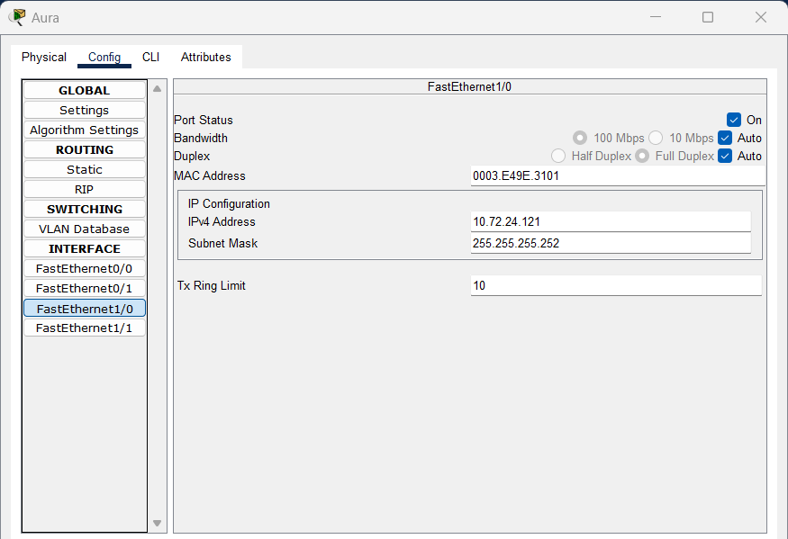

    Atur IP interface dari router subnet yang mengarah ke router utama.
    (Contoh: Subnet A15, Frieren -> Aura)
    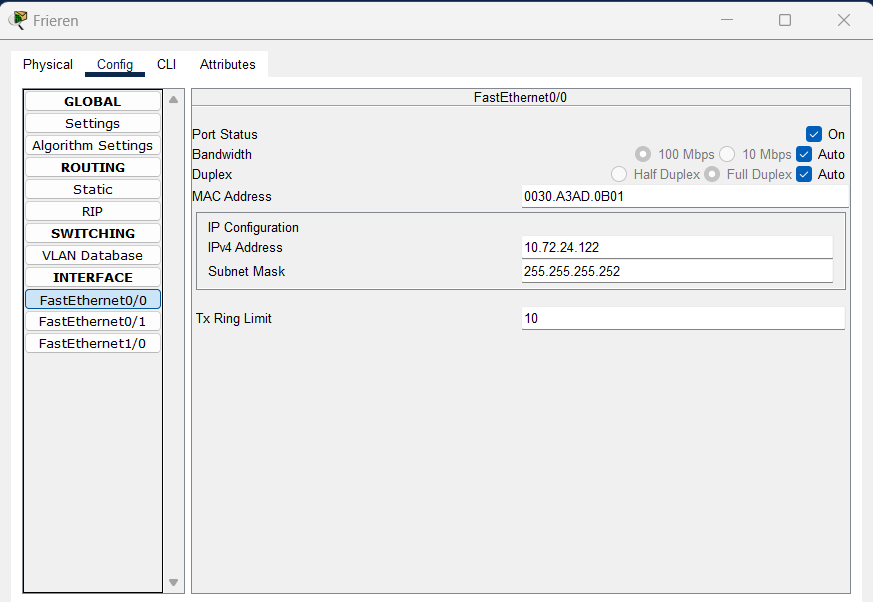
    Lakukan untuk semua subnet.

2) Routing\
    Atur default routing dari router subnet ke router utama.
    (Contoh: Frieren -> Aura)
    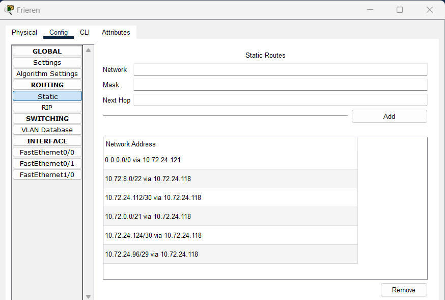

    Atur routing dari router utama ke subnet client.
    (Contoh: Subnet A2, Aura -> Frieren)
    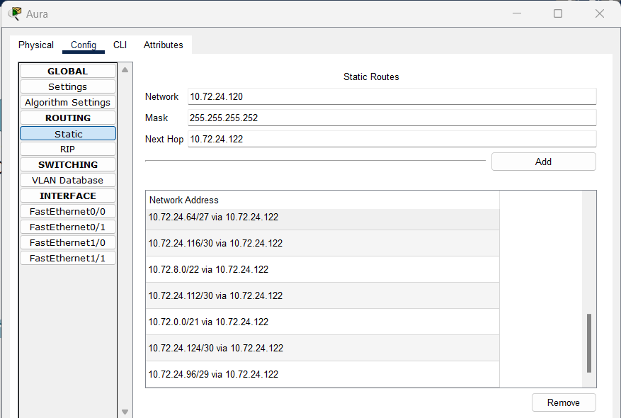
    Lakukan untuk semua subnet.

3) Testing\
    Sekarang kita akan melakukan testing. Contoh yang akan digunakan adalah dari LakeKorridor ke Aura dan sebaliknya.
    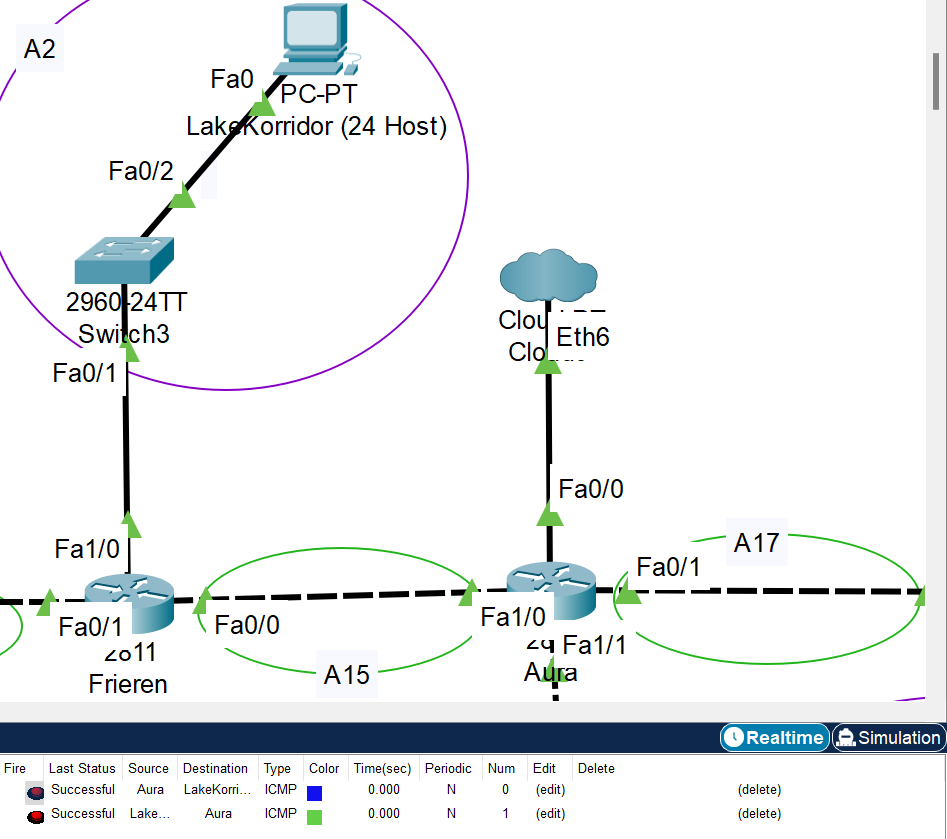

## CIDR
### Topologi CIDR
Tentukan subnet dari topologi, dengan metode CIDR.
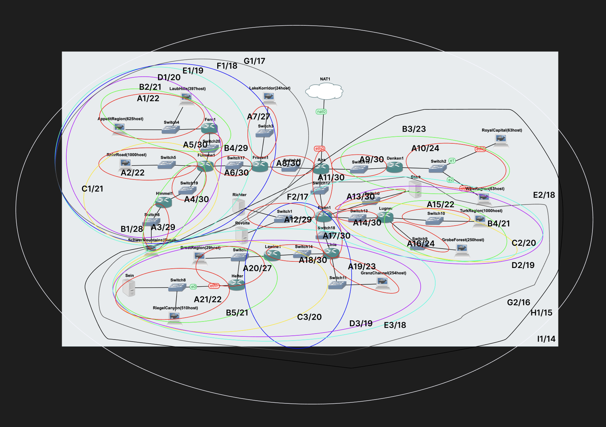

### Rute dan Subnet Mask
Tentukan subnet mask dari masing-masing subnet, dengan jumlah host yang dibutuhkan yang tercamtum di topologi.
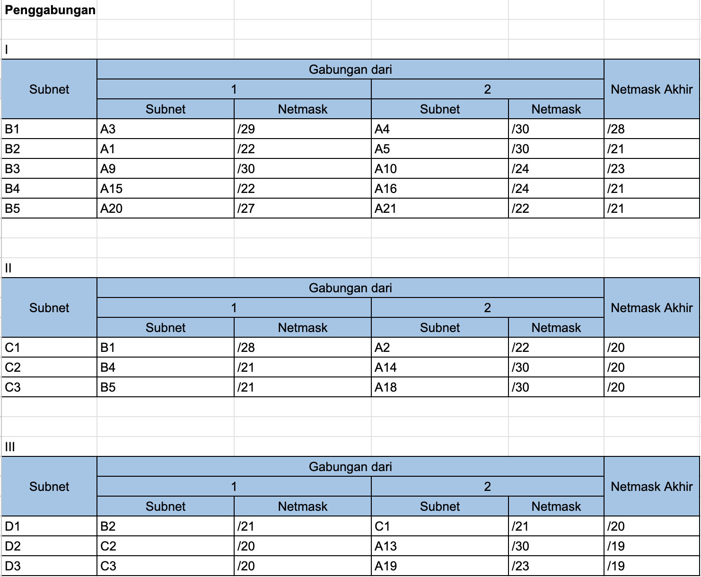
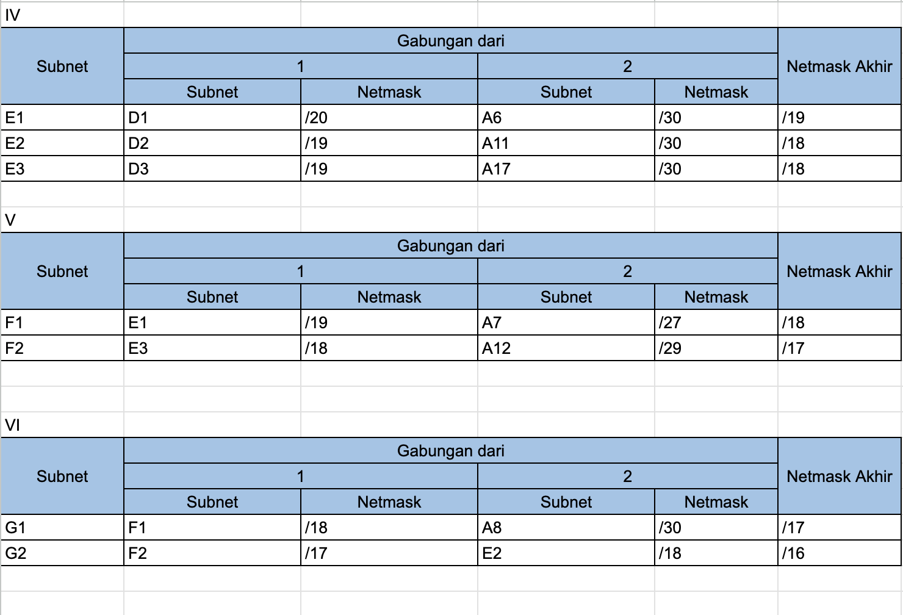
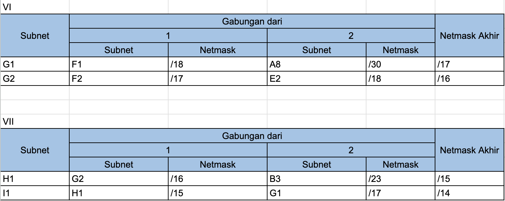

### Konfigurasi IP
Buat perhitungan dari subnet mask dari masing-masing subnet untuk menentukan pembagian konfigurasi IP.
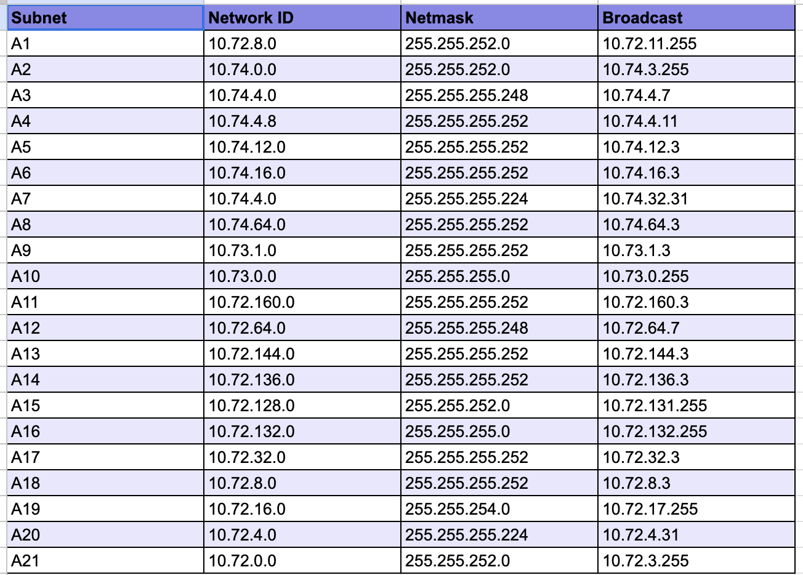

### CIDR Tree
Berdasarkan konfigurasi IP yang sudah didapatkan, gambarkan tree CIDR nya.
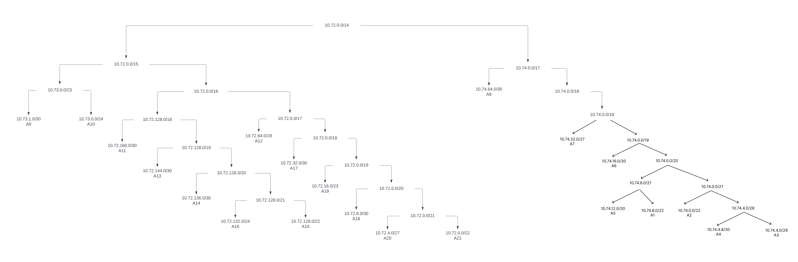

### Konfigurasi di GNS
Kami tidak sempat mengimplementasikan pada gns